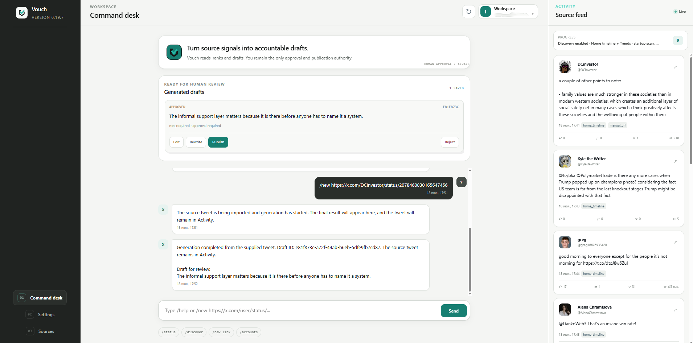
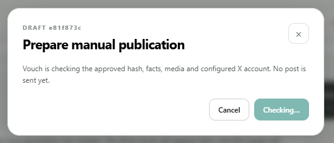
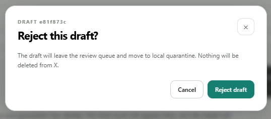

# Vouch

Built with GPT-5.6 and OpenAI Codex

Vouch was built with GPT-5.6 in ChatGPT and OpenAI Codex. GPT-5.6 is also used inside the product itself.

### How Vouch uses GPT-5.6

Vouch uses GPT-5.6 through the OpenAI API for the parts of the workflow that require semantic judgment:

- analyzing source material and its context;
- deciding whether there is enough material for a useful post;
- selecting a supported content angle;
- generating and ranking distinct draft candidates;
- separating factual claims, attribution, interpretation, and opinion;
- connecting claims to their supporting sources;
- detecting unsupported details, missing context, and weak editorial value;
- revising drafts after validation or human edits;
- adapting the result to the user's personal writing style.

Model responses use structured schemas so Vouch can validate and store the results instead of treating free-form text as application state.

GPT-5.6 does not control publication. Vouch separately checks the source references, draft version, approval state, and publication hash. A human still reviews and approves the exact version that can be published.

### How GPT-5.6 and ChatGPT were used during development

I started building Vouch in ChatGPT with GPT-5.6.

I used it for:

- the original product idea and architecture;
- the web and desktop interface design;
- backend services and integrations;
- the generation, validation, and humanizer systems;
- technical specifications for new versions;
- regression cases based on real failures;
- test planning and release audits;
- documentation and submission materials.

The process was not a single prompt followed by a finished product.

I tested Vouch in real workflows, found where the output or application behavior was wrong, and wrote new requirements. Those failures became code changes, tests, validation rules, or new product decisions.

This happened repeatedly across the whole project.

### How OpenAI Codex was used

I also used Codex throughout development, and relied on it more heavily as the repository became larger and the final changes started affecting many parts of the application at once.

Codex was especially useful for:

- tracing behavior across connected services;
- implementing changes across the backend, database, configuration, UI, and tests;
- debugging problems from application and CI logs;
- updating migrations and release files;
- keeping the web app, desktop app, Telegram bot, background workers, and X integration consistent;
- running and fixing the linting, formatting, typing, testing, packaging, and security pipeline;
- reviewing the final public repository and release artifacts.

The work was not divided into a clean “ChatGPT did this, Codex did that” structure. I often used both on the same feature.

ChatGPT was useful for working through the product behavior and turning rough ideas or failures into detailed requirements. Codex made it faster to apply, inspect, and verify those changes across the repository.

### Development loop

A normal development cycle looked like this:

1. I found a problem or decided how a feature should work.
2. I described the expected behavior and constraints in ChatGPT or Codex.
3. GPT-5.6 helped turn the requirement into a concrete plan and implementation.
4. ChatGPT or Codex helped write and review the code.
5. I tested the result in the real application.
6. Failures became regression tests, product rules, or additional fixes.
7. I ran another audit before preparing the next release.

I made the product decisions, tested the real workflows, reviewed the output, and decided what needed to change.

GPT-5.6 and Codex helped produce the design, application code, integrations, content pipeline, tests, documentation, and release process that make up Vouch today.


**A local-first editorial workspace for turning X source signals into reviewable, accountable drafts.**

Vouch reads selected X sources, preserves the original evidence, proposes drafts in a personal voice, and keeps a human in control of every approval and publication decision. It is built for creators and small editorial teams who want AI assistance without surrendering authorship or publishing authority.

> Vouch never auto-publishes. Every X write requires a reviewed draft, a current approval, a matching content hash, completed factual checks, and an explicit user action.

## Product tour

### Command desk and source feed

The central workspace combines source discovery, durable chat history, generated drafts, and a chronological X source feed. New sources remain visible beside the draft they inspired.



### Passwordless private workspaces

Email OTP sign-in creates an isolated local workspace. Account configuration, source history, drafts, credentials, and the personal voice profile stay bound to that account.


### Deliberate publication controls

Drafts can be edited, rewritten, approved, rejected, or prepared for manual publication. Vouch rechecks the approved hash, facts, media, and configured X account before enabling the final action.

| Publication preview | Rejection workflow |
| --- | --- |
|  |  |

## Why Vouch exists

Direct AI drafting can quietly turn incomplete evidence into confident claims. A limited pilot becomes a worldwide launch; an attributed observation becomes an unsupported fact; a source-dependent reaction is published without its original context.

Vouch treats generation as an editorial process rather than a text box:

1. Collect a bounded set of official X sources.
2. Preserve source provenance and media context.
3. Rank candidates and try the strongest usable source first.
4. Generate a draft in the account's stored voice profile.
5. Run deterministic editorial, attribution, factual, similarity, and length checks.
6. Save the result as a versioned review artifact.
7. Require explicit human approval before any publication workflow.

## Highlights

- **Official X API sources** — home timeline, trends, selected accounts, direct public X URLs from any account, and eligible mention/reply events.
- **Persistent source feed** — newest posts appear first while older evidence remains available.
- **Personal voice onboarding** — ten account-bound questions capture tone, reasoning style, humor, sarcasm, rhythm, and feedback preferences.
- **Account isolation** — each email account receives separate data, drafts, logs, configuration, credentials, and voice state.
- **Reviewable drafts** — edit, rewrite, approve, reject, and manually publish from the web interface.
- **Context-aware publication** — when a draft requires quote context, Vouch provides a direct link to the original X post.
- **Version and hash integrity** — any text or media change creates a new version and revokes the previous approval.
- **Local-first operation** — SQLite and human-readable draft bundles remain on the operator's machine by default.
- **Web, desktop, CLI, and Telegram surfaces** — shared services and the same safety rules across every interface.
- **Budget and pacing controls** — bounded discovery, request pacing, estimated costs, and daily limits.

## Safety model

Vouch is intentionally fail-closed:

- `AUTO_PUBLISH=true` is rejected as a configuration error.
- Schedulers may read, rank, and generate, but cannot approve, publish, delete, or send replies.
- X writes are only available through the deterministic `PublishingService`.
- Approval is tied to the current draft version and canonical content/media hash.
- Facts, blocking flags, media manifests, account identity, and publication state are revalidated immediately before a write.
- Partial thread publication is durable and does not blindly repeat successful items.
- Tests and health checks use fakes and never call production write endpoints.
- Provider secrets are write-only and are never returned to the browser or stored in the database.

## Architecture

```text
Official X reads / direct URL / mentions
                  │
                  ▼
        Source persistence + provenance
                  │
                  ▼
       Ranking and reference selection
                  │
                  ▼
  Evidence packet → generation → inspection
                  │
                  ▼
        Versioned draft + local bundle
                  │
                  ▼
      Human edit / rewrite / approval
                  │
                  ▼
       Explicit manual X publication
```

The domain layer is independent of FastAPI, SQLAlchemy, and provider SDKs. Web, CLI, desktop, and Telegram call the same transactional services. Providers implement shared async interfaces, while repositories own persistence and services own use cases.

## Quick start on Windows

Requirements:

- Windows 10 or 11
- Python 3.13
- Official X API credentials for the sources you enable
- An OpenAI or xAI key for live generation
- SMTP or Supabase configuration for email sign-in

```powershell
git clone <your-repository-url>
cd Vouch
powershell.exe -NoProfile -ExecutionPolicy Bypass -File .\scripts\setup_local.ps1
.\START_WEB.bat
```

Open [http://127.0.0.1:8000](http://127.0.0.1:8000).

The setup script creates `.venv`, installs locked dependencies, applies Alembic migrations, validates configuration, and keeps the server bound to loopback by default.

## Configuration

Copy `.env.example` to `.env` or run `CONFIGURE_VOUCH.bat`. Never commit `.env`.

Core settings include:

```dotenv
AUTH_MODE=local
LOCAL_OTP_DELIVERY=smtp
SMTP_HOST=smtp.example.com
SMTP_PORT=587
SMTP_FROM_EMAIL=vouch@example.com

OPENAI_API_KEY=
XAI_API_KEY=

X_BEARER_TOKEN=
X_CONSUMER_KEY=
X_CONSUMER_SECRET=
X_ACCESS_TOKEN=
X_ACCESS_TOKEN_SECRET=
X_USER_ID=

PUBLISH_ENABLED=false
AUTO_PUBLISH=false
```

Non-secret source, discovery, generation, and publishing settings live under `config/`. Secrets stay in the local environment and are masked in the web settings UI.

## Common workflows

### Generate from an X URL

Paste a direct X post URL into the command desk:

```text
/new https://x.com/user/status/1234567890
```

The source is stored in Activity, generation runs in the background, and the saved draft appears in the review panel.

### Review a draft

- **Edit** saves a human revision as a new version.
- **Rewrite** makes an explicit AI generation request with optional guidance.
- **Approve** binds approval to the current content and media hash.
- **Reject** moves the local bundle to quarantine; it does not delete anything from X.
- **Publish** opens a final preview and performs a manual write only when every gate passes.

### Quote-context fallback

Some reactions are not meaningful as standalone posts. If the configured X plan cannot create the required quote post, Vouch stops safely and places a clickable link to the original post in the command chat for fast manual handling.

`X_USER_ID` identifies the account used for home-timeline and mention reads. It does not restrict the author of a manually supplied `/new` source. The authenticated OAuth writer returned by X is shown in the final publication preview.

## CLI

```powershell
python -m app.cli --help
python -m app.cli doctor
python -m app.cli account login
python -m app.cli drafts list
```

The CLI uses the same account workspace, services, state transitions, approvals, and publication gates as the web and desktop interfaces.

## Development checks

```powershell
python scripts/check.py
python -m alembic upgrade head
python -m app.cli --help
```

The complete check runs Ruff, mypy, and pytest. All external API calls are mocked in tests and network access fails closed.

## Repository map

```text
app/domain/       lifecycle, security, and content contracts
app/services/     transactional use cases
app/providers/    generation provider adapters
app/x_api/        official X read/write boundaries
app/web/          FastAPI dashboard and static product UI
app/telegram/     Telegram review interface
alembic/          database migrations
config/           versioned non-secret runtime configuration
scripts/          setup, checks, release, backup, and demo tooling
tests/            unit, integration, safety, and regression coverage
```

## Status

Vouch `0.19.7` is a release candidate. It is designed for local evaluation and controlled manual publishing. Review your X plan capabilities, provider costs, SMTP configuration, and publication settings before using live credentials.

## License

See [LICENSE](LICENSE).
